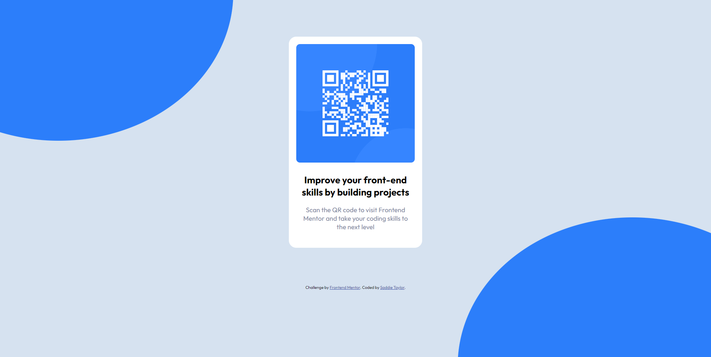

# Frontend Mentor - QR code component solution

This is a solution to the [QR code component challenge on Frontend Mentor](https://www.frontendmentor.io/challenges/qr-code-component-iux_sIO_H). Frontend Mentor challenges help you improve your coding skills by building realistic projects. 

## Table of contents

- [Overview](#overview)
  - [Screenshots](#screenshots)
  - [Built with](#built-with)
  - [Continued development](#continued-development)
- [Author](#author)

**Note: Delete this note and update the table of contents based on what sections you keep.**

## Overview
My first Frontend project on Frontend Mentor. I started it off with the simple, reccommended one to beginners. This was just a quick way to practice what I know already.

### Screenshot

### Built with

- Semantic HTML5 markup
- CSS properties
- Flexbox

### Continued development

I really want to continue to learn and eventually master, or come close to anyway (everything is always changing!), all of HTML and CSS and the cool tricks to make my sites/projects look super really nice!

## Author

- Website - [Saddie Taylor](https://saddi3taylor.github.io/personal-site-2023/)
- Frontend Mentor - [@saddi3taylor](https://www.frontendmentor.io/profile/saddi3taylor)
- Twitter - [@saddi3taylor](https://www.twitter.com/saddi3taylor)